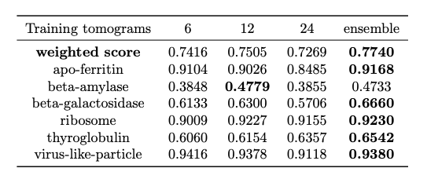

# CZII_ML_Challenge_Winning_Models
The re-implementation of 1st winning team's solution [kaggle-cryoet-1st-place-segmentation](https://github.com/ChristofHenkel/kaggle-cryoet-1st-place-segmentation/tree/main) in pytorch-lightning and copick.


## Benchmark
We are able to train 3 models (resnet34 backbones) with 6, 12, and 24 tomograms respectively, and achieved an esenmble score of 0.774. This is comparable to the original submission of the 1st place [kaggle-cryoet-leader-board](https://www.kaggle.com/competitions/czii-cryo-et-object-identification/leaderboard).
<p align="center">
  
</p>


## Installation
cd into the root folder, then 
```
pip install -e .
```

## Copick configuration file
The copick data ingestion can automatically populate many important internal variables from the config file. Especially, the metrics for the evaluation process, such as `score_threshold` and `score_weight` are stored under the metadata key in the configuration file. An example of copick config file is shown below:
```
{
    "name": "Phatom Dataset",
    "description": "CZII ML Challenge Training dataset",
    "version": "1.0.1",
    "pickable_objects": [
        {
            "name": "apo-ferritin",
            "is_particle": true,
            "pdb_id": "4V1W",
            "label": 1,
            "color": [  0, 117, 220, 255],
            "radius": 60,
            "map_threshold": 0.0418,
            "metadata": {
                "score_weight": 1,
                "score_threshold": 0.16
            }
        },
        {
            "name": "beta-amylase",
            "is_particle": true,
            "pdb_id": "1FA2",
            "label": 2,
            "color": [153,  63,   0, 255],
            "radius": 65,
            "map_threshold": 0.035,
            "metadata": {
                "score_weight": 0,
                "score_threshold": 0.25
            }
        },
        {
            "name": "beta-galactosidase",
            "is_particle": true,
            "pdb_id": "6X1Q",
            "label": 3,
            "color": [ 76,   0,  92, 255],
            "radius": 90,
            "map_threshold": 0.0578,
            "metadata": {
                "score_weight": 2,
                "score_threshold": 0.13
            }
        },
        {
            "name": "ribosome",
            "is_particle": true,
            "pdb_id": "6EK0",
            "label": 4,
            "color": [  0,  92,  49, 255],
            "radius": 150,
            "map_threshold": 0.0374,
            "metadata": {
                "score_weight": 1,
                "score_threshold": 0.19
            }
        },
        {
            "name": "thyroglobulin",
            "is_particle": true,
            "pdb_id": "6SCJ",
            "label": 5,
            "color": [ 43, 206,  72, 255],
            "radius": 130,
            "map_threshold": 0.0278,
            "metadata": {
                "score_weight": 2,
                "score_threshold": 0.18
            }
        },
        {
            "name": "virus-like-particle",
            "is_particle": true,
            "label": 6,
            "color": [255, 204, 153, 255],
            "radius": 135,
            "map_threshold": 0.201,
            "metadata": {
                "score_weight": 1,
                "score_threshold": 0.5
            }
        }
    ],
    "config_type": "czii cryoet mlchallenge dataset",
    "overlay_root": "local:///PATH/TO/EXTRACTED/PROJECT/",
    "static_root": "local:///PATH/TO/EXTRACTED/PROJECT/"
}
```


## Training from scratch
The code support loading data via copick and directly loading zarr data. An example training command is below.
```
python train.py \
    --copick_config COPICK_CONFIG_FILE \
    --train_run_names TS_6_4,TS_6_6,TS_69_2,TS_73_6,TS_86_3,TS_99_9 \
    --val_run_names TS_5_4 \
    --batch_size 16 \
    --n_aug 1112 \
    --output_dir OUTPUT_PATH \
    --job_id job_1 \
    --epochs 100   
```

## Re-training from a checkpoint for the same dataset
```
python train.py \
    --copick_config COPICK_CONFIG_FILE \
    --train_run_names TS_6_4,TS_6_6,TS_69_2,TS_73_6,TS_86_3,TS_99_9 \
    --val_run_names TS_5_4  \
    --batch_size 16 \
    --n_aug 1112 \
    --output_dir OUTPUT_PATH \
    --job_id job_1 \
    --epochs 100 \
    --pretrained_weight CHECKPOINT_PATH   
```

## Subset transfer learning: re-training from a checkpoint for a different dataset 
The conept of subset transfer learning is to load a checkpoint from a pretrained model and fintune based on a new dataset that may contain only a subset of classes. In this case, we need to know the classes the checkpoint was trained on. This information can be found by loading the checkpoint and print out the `model.description` attribute.
```
>>> from czii_cryoet_models.model import SegNet
>>> model = SegNet.load_from_checkpoint('/hpc/projects/group.czii/kevin.zhao/ml_challenge/winning_models/czii_cryoet_mlchallenge_models/output_test/checkpoints/best_model-v6.ckpt')
>>> print(model.description)
SegNet model predicting 6 classes

Class details:
{
  "apo-ferritin": {
    "channel_id": 0,
    "radius": 60.0,
    "score_threshold": 0.16,
    "score_weight": 1
  },
  "beta-amylase": {
    "channel_id": 1,
    "radius": 65.0,
    "score_threshold": 0.25,
    "score_weight": 0
  },
  "beta-galactosidase": {
    "channel_id": 2,
    "radius": 90.0,
    "score_threshold": 0.13,
    "score_weight": 2
  },
  "ribosome": {
    "channel_id": 3,
    "radius": 150.0,
    "score_threshold": 0.19,
    "score_weight": 1
  },
  "thyroglobulin": {
    "channel_id": 4,
    "radius": 130.0,
    "score_threshold": 0.18,
    "score_weight": 2
  },
  "virus-like-particle": {
    "channel_id": 5,
    "radius": 135.0,
    "score_threshold": 0.5,
    "score_weight": 1
  }
}
```


## Inference
An example command for inference with PyTorch checkpoints (a single checkpoint file path or multiple folder paths, each containing mutiple checkpoints) that supports pattern matching. 

```
python inference.py \
    --copick_config copick_config.json \
    --run_names TS_100_4,TS_100_6,TS_100_7,TS_100_9 \
    --pretrained_weights FOLDER_PATH1/checkpoints/,FOLDER_PATH2/checkpoints/,FOLDER_PATH3/checkpoints/ \
    --batch_size 16 \
    --output_dir OUTPUT_PATH \
    --pattern *v1.ckpt 
```

Inference by loading zarr files:
```
python inference_custom.py \
    --file_path FOLDER_PATH_TO_ZARR_FILES \
    --pretrained_weights oFOLDER_PATH1/checkpoints/,FOLDER_PATH2/checkpoints/,FOLDER_PATH3/checkpoints/ \
    --batch_size 16 \
    --output_dir OUTPUT_PATH \
    --pixelsize PIXEL_SIZE \
    --pattern *v1.ckpt 
```


## License
MIT License

Copyright (c) 2025 CZII

Permission is hereby granted, free of charge, to any person obtaining a copy
of this software and associated documentation files (the "Software"), to deal
in the Software without restriction, including without limitation the rights
to use, copy, modify, merge, publish, distribute, sublicense, and/or sell
copies of the Software, and to permit persons to whom the Software is
furnished to do so, subject to the following conditions:

The above copyright notice and this permission notice shall be included in all
copies or substantial portions of the Software.

THE SOFTWARE IS PROVIDED "AS IS", WITHOUT WARRANTY OF ANY KIND, EXPRESS OR
IMPLIED, INCLUDING BUT NOT LIMITED TO THE WARRANTIES OF MERCHANTABILITY,
FITNESS FOR A PARTICULAR PURPOSE AND NONINFRINGEMENT. IN NO EVENT SHALL THE
AUTHORS OR COPYRIGHT HOLDERS BE LIABLE FOR ANY CLAIM, DAMAGES OR OTHER
LIABILITY, WHETHER IN AN ACTION OF CONTRACT, TORT OR OTHERWISE, ARISING FROM,
OUT OF OR IN CONNECTION WITH THE SOFTWARE OR THE USE OR OTHER DEALINGS IN THE
SOFTWARE.
